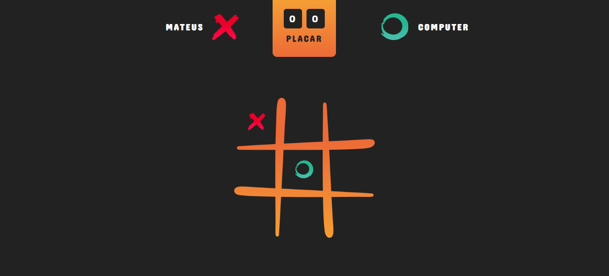

# JOGO DA VELHA

## REGRAS DO JOGO
- O tabuleiro  é uma matriz  de três linhas por três colunas.
- Dois jogadores escolhem uma marcação cada um, geralmente um círculo (O) e um xis (X).
- Os jogadores jogam alternadamente, uma marcação por vez, numa lacuna que esteja vazia.
- O objetivo é conseguir três círculos ou três xis em linha, quer horizontal, vertical ou diagonal, e ao mesmo tempo, quando possível, impedir o adversário de ganhar na próxima jogada.

## TELAS DO JOGO
O usuário informa qual o seu nome.

O usuário joga clicando em uma área do tabuleiro.

É mostrado o resultado do vencedor, e com um botão com o ícone de "return", o usuário pode iniciar outra rodada.

Caso não haja um vencedor, o "deu velha" é mostrado indicando que deu empate.

